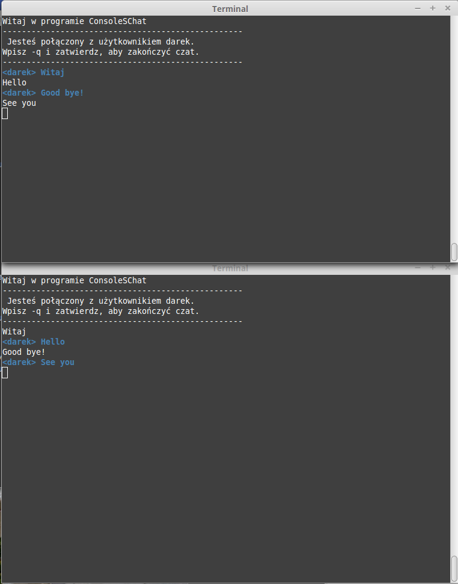

ConsoleSChat
===================

Skrypt w Perl do czatowania między konsolami. Utworzony dodatkowo wątek w perlu na bierząco monitoruje przychodzące wiadomości z sieci.

----------

Cel projektu
-------------

Projekt zaliczeniowy "Pracowania Języków Skryptowych".

